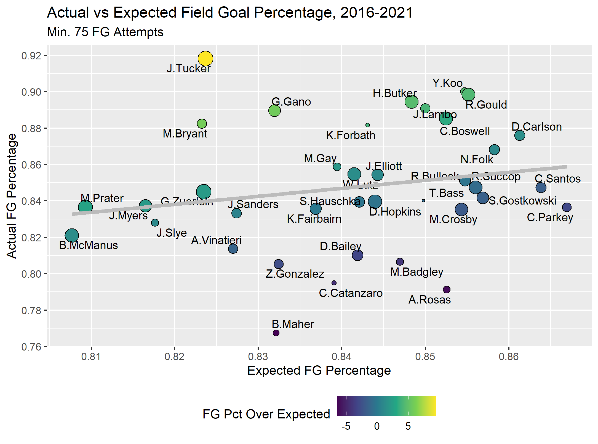
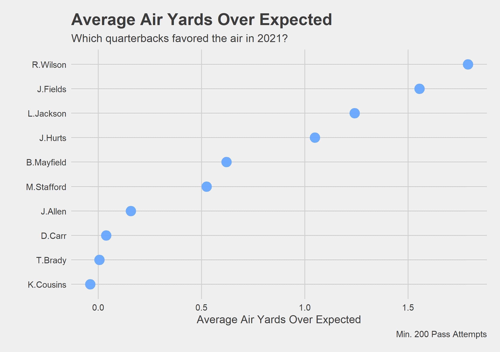

# NFL Modeling
R modeling practice with NFL data via [the nflfastR package](https://www.nflfastr.com/).

## Figures

### Figure 1: Field Goal Percentage Over Expectation

The figure below represents the relationship between each kicker's actual and expected field goal percentage from 2016 to 2021. Colored by their percentage over expectation and sized based on their number of field goal attempts, each point represents a kicker that has reached the threshold of 75 attempts since 2016. The code for Figure 1 can be viewed [here](https://github.com/jbrooksdata/nfl-modeling/blob/main/R/field%20goal%20pct%20expectation.R).

### Figure 2: Average Air Yards Over Expectation

The dot chart below represents the top 10 quarterbacks of the 2021 season ranked by average air yards over expectation. The expectation model for this data accounts for variables like time remaining and score differential to determine expected air yards based on various game situations. The code for Figure 2 can be viewed [here](https://github.com/jbrooksdata/nfl-modeling/blob/main/R/air%20%20yards%20expectation.R).

## Notes

- Figures 1 and 2 inspired by [Tej Seth's Basic Modeling Using NFL Data tutorial](https://www.youtube.com/watch?v=J4p8ZfYW5Oo).
